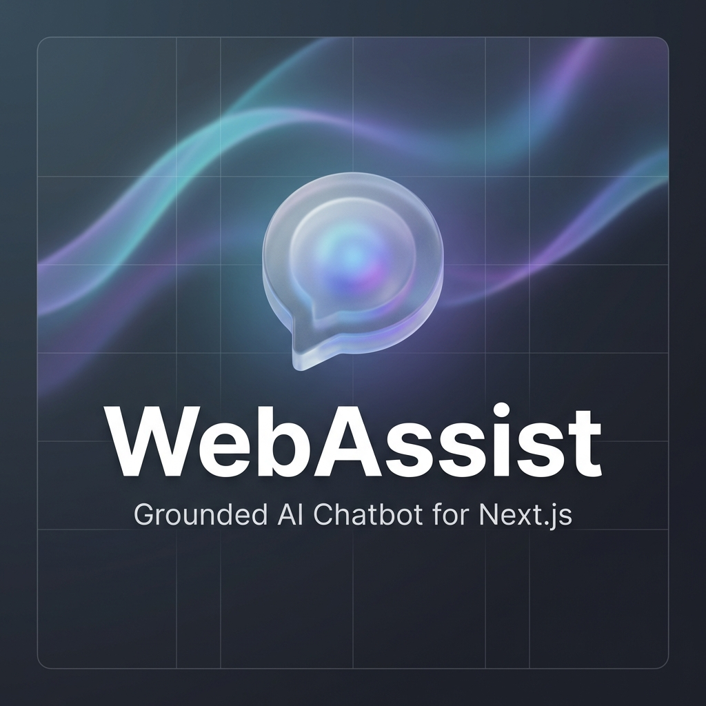

# 🤖 WebAssist-Template



**The ultimate Q&A Chatbot Template for Next.js applications.**

> [!TIP]
> **Use this Template:** Click the green **"Use this template"** button on GitHub to create a new repository based on this project.

WebAssist is a lightweight, FAQ-first chatbot for Next.js applications. It grounds answers in your own MDX content (no hallucinations), provides a clean UI widget, and gracefully falls back to a structured intake form when it can't help.

## Features

- **🛡️ No Hallucinations:** Answers are strictly grounded in your local Markdown/MDX files.
- **💬 Clean UI:** A modern, responsive chat widget and window built with Tailwind CSS and Framer Motion.
- **📥 Smart Fallback:** Automatically suggests an intake form when confidence is low.
- **💾 Persistent History:** Chats are saved to local storage so users don't lose context.
- **🤖 Deployment Help:** The chatbot itself can guide you through deployment steps!
- **🚀 Ready to Deploy:** Built on Next.js 14+ (App Router) and works with Vercel, Netlify, and more.

## Quick Start

1.  **Clone the repository:**
    ```bash
    git clone https://github.com/RW2023/webassist.git
    cd webassist
    ```

2.  **Install dependencies:**
    ```bash
    npm install
    ```

3.  **Set up your OpenAI API key:**
    Create a `.env.local` file:
    ```env
    OPENAI_API_KEY=sk-your-key-here
    ```
    Get your key from [OpenAI Platform](https://platform.openai.com/api-keys).

4.  **Run the development server:**
    ```bash
    npm run dev
    ```

5.  **Open your browser:**
    Navigate to [http://localhost:3000](http://localhost:3000). The chat widget will appear in the bottom-right corner.

## Usage

### Adding Knowledge

Add your FAQ content as `.mdx` or `.md` files in `src/content/faqs/`.
The filename doesn't matter, but the content should be structured with H2 headers for questions:

```markdown
## What are your support hours?
We are available Monday to Friday, 9am to 5pm EST.

## How do I reset my password?
Go to the settings page and click "Reset Password".
```

### Security & Gated Access

WebAssist includes a premium security layer that balances developer costs with user flexibility.

- **Bring Your Own Key (BYOK):** Users can enter their own OpenAI API key in the settings (gear icon). This key is stored securely in their browser's `localStorage` and sent via encrypted headers, completely bypassing your server's budget.
- **Gated Access Password:** To prevent public abuse of your `OPENAI_API_KEY`, you can enable "Gated Access".
  1. Add `ACCESS_PASSWORD=your_secure_password` to your `.env.local`.
  2. Users must then enter this password in the chat settings to "unlock" the bot.
  3. If neither a custom key nor the correct password is provided, the API returns a `401 Unauthorized` error.

#### Visual Indicators
The chat header features a color-coded pulse to show the active connection state:
- 🟢 **Green Pulse:** Using a custom OpenAI API key (BYOK).
- 🔵 **Blue Pulse:** Accessing the developer's key via Access Password.
- ⚪ **No Pulse:** Unauthorized (setup required in settings).

### Configuration

Edit `src/config/chatbot.ts` to customize:
- **name** — Bot display name
- **welcomeMessage** — First message users see
- **systemPrompt** — AI behavior and tone
- **fallbackButtonText** — Contact button label
- **intake** — Contact form configuration

### Advanced Logic

- **Matching Logic:** Built-in keyword matching and context grounding in `src/lib/chat/mdx-loader.ts`.
- **API Security:** Robust header-based authentication logic in `src/app/api/chat/route.ts`.
- **State Persistence:** Automatic state synchronization with `localStorage` in `src/components/chat/useChat.ts`.

## Deployment

### Quick Deploy to Vercel (Recommended)

1. Push your code to GitHub
2. Visit [vercel.com](https://vercel.com) and import your repo
3. Add `OPENAI_API_KEY` to environment variables
4. Deploy!

### Deploy to Your Existing Next.js App

Want to add this chatbot to an existing project? See the detailed integration guide in [DEPLOYMENT.mdx](./DEPLOYMENT.mdx) for step-by-step instructions.

**Or just ask the chatbot!** Click the chat widget and ask:
- "How do I deploy this?"
- "Can I add this to my existing Next.js app?"
- "What are the deployment prerequisites?"

The bot has comprehensive deployment knowledge built-in and can guide you through the process.

## Tech Stack

- **Framework:** [Next.js](https://nextjs.org/) 16 (App Router)
- **Styling:** [Tailwind CSS](https://tailwindcss.com/) 4
- **Animations:** [Framer Motion](https://www.framer.com/motion/)
- **Icons:** [Lucide React](https://lucide.dev/)
- **AI:** [OpenAI](https://openai.com/) GPT-3.5-turbo

## License

MIT

